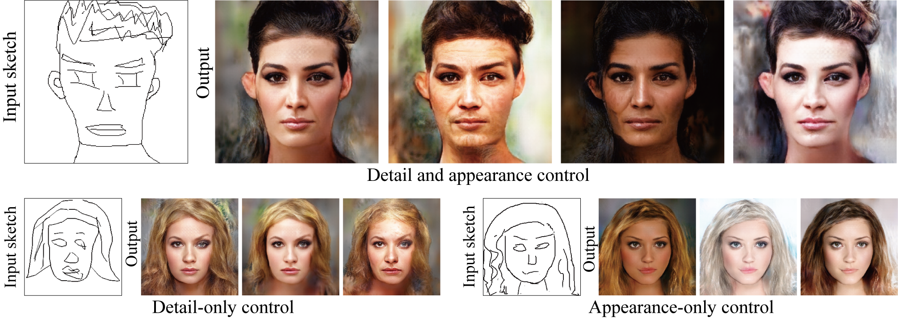

# Diversifying Detail and Appearance in Sketch-Based Face Image Synthesis



This code is our implementation of the following paper:

Takato Yoshikawa, Yuki Endo, Yoshihiro Kanamori: "Diversifying Detail and Appearance in Sketch-Based Face Image Synthesis" Visual Computer (Proc. of Computer Graphics Internatinal 2022), 2022. [[Project](http://www.cgg.cs.tsukuba.ac.jp/~yoshikawa/pub/sketch_to_diverse_image/)][[PDF (28 MB)](http://www.cgg.cs.tsukuba.ac.jp/~yoshikawa/pub/sketch_to_diverse_image/pdf/Yoshikawa_CGI2022.pdf)]

## Prerequisites
Run the following code to install all pip packages.

```
pip install -r requirements.txt
```

## Inference with our pre-trained models
1. Download our [pre-trained models](https://drive.google.com/file/d/1OMMnm5Ez5rq1YYbbLWTelpL4EKwhzjy0/view?usp=sharing) for CelebA-HQ dataset and put them in the "pretrained_model" directory in the parent directory.
2. Download "Human-Drawn Facial sketches" in [DeepPS](https://github.com/VITA-Group/DeepPS) and put "sketches" directory in them in the "data" directory in the parent directory.
3. Run test.py
```
cd src
python test.py
```

## Training
Download the dataset from [Google Drive](https://drive.google.com/drive/folders/1NSuh0L5RTFQq0lwZq0NRAiloX_ar-kWa?usp=sharing) to the "data" directory.

### Training the detail network H
```
cd src
python train.py \
--train_path ../data/CelebA-HQ256_DFE \
--edge_path ../data/CelebA-HQ256_HED \
--edgeSmooth \
--save_model_name network-H
```
### Training the appearance network F
```
cd src
python train.py \
--train_path ../data/CelebA-HQ256 \
--edge_path ../data/CelebA-HQ256_DFE \
--weight_feat 0.0 \
--save_model_name network-F
```

## Citation
please cite our paper if you find the code useful:
```
@article{YoshikawaCGI22,
    author    = {Takato Yoshikawa and Yuki Endo and Yoshihiro Kanamori},
    title     = {Diversifying Detail and Appearance in Sketch-Based Face Image Synthesis},
    journal   = {Visual Computer (Proc. of Computer Graphics Internatinal 2022)},
    volume    = {},
    number    = {},
    pages     = {},
    year      = {2022}
}
```

## Acknowledgements
This code heavily borrows from the [DeepPS](https://github.com/VITA-Group/DeepPS) repository.